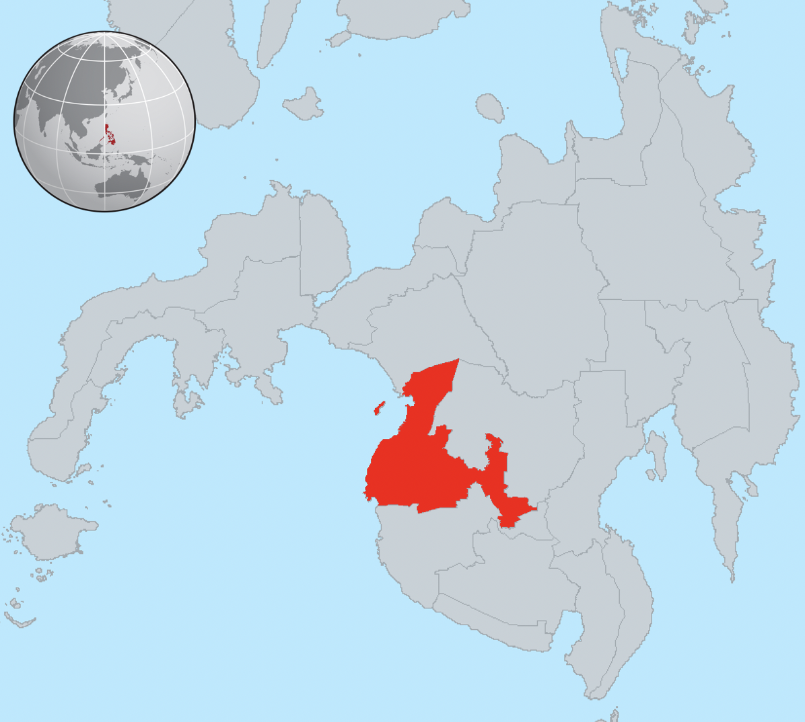
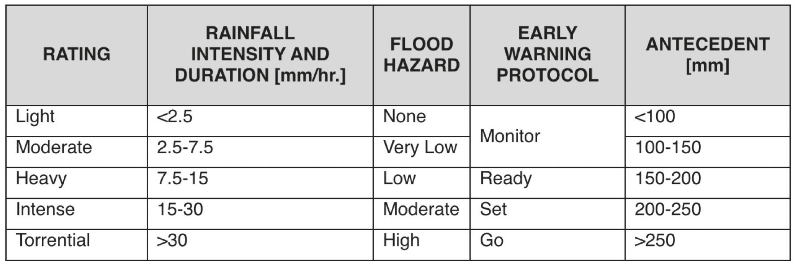
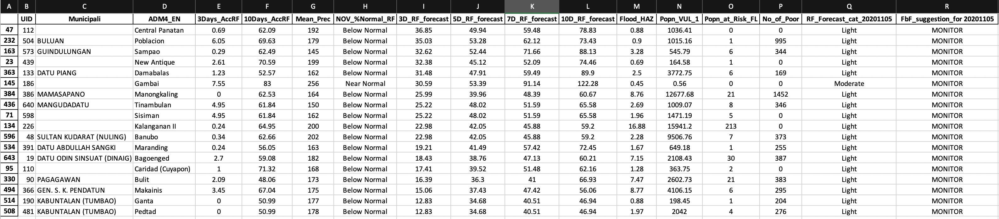
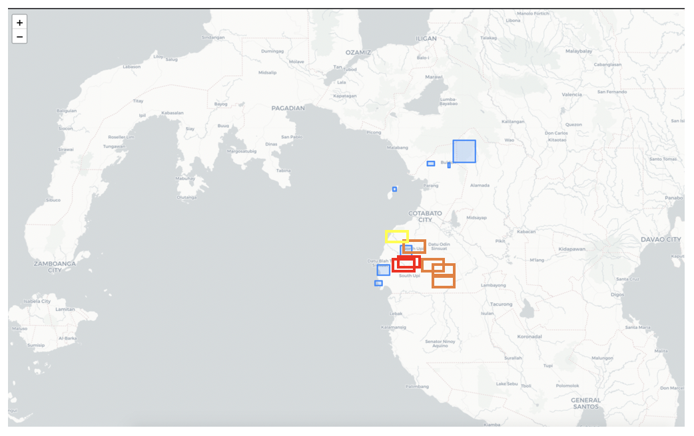

## WFP Philippines Forecast Based Financing Geogrraphical Targetting
This pilot model aims to limit the area forr geographical tarrrgeting for Cash Based Trasfer Assistance Modality by WFP Philippines in Maguindanao.

---

The script runs on Gooogle Earth Engine for computing pasc accumulated rainfall and to get population layer (for exposure computation) from WorldPop. The Rainfall forecast is taken from ECMWF from WFP private repository. Flood hazard data for Maguindanao were taken from LiPAD project of UP and from MGB Geohazard data. The number of poor families were acquired from Listahanan database (2017 data)

The FbF action uses the categorization below for early warning protocols based on the information provided by past accumulation of rainfall, montlhy percent normal exceedance, flood hazard exposure and rainfall forecast information with 10 days lead time.

---
### Example results

#### Table shwoing the computed values and recommended early action by ADM4 (barangay level)

#### Map view of the barangay extent (envelope or bounding box) where early action is required

---

This is a working model.

Contributors:
Michael Andrew Manalili (Main Developer)
Abdel-Lathif Younous (Climatologist)
Jesse Mason (FbF Focal Point - WFP / Climatologist)
Juanito Berja (VAM Officer - WFP)
Joan Odena - (WFP Philippines)
Isabelle Lacson (WFP Philippines)